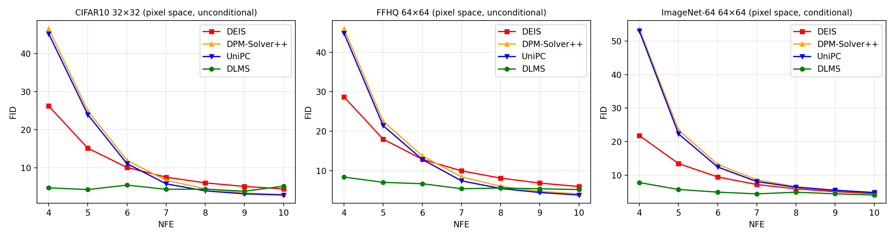

# DLMS: Linear Multistep Solver Distillation - Reimplementation

Reimplementation of: Yuchen Liang, Xiangzhong Fang, Hanting Chen, Yunhe Wang. "Linear Multistep Solver Distillation for Fast Sampling of Diffusion Models." ICLR 2025. [OpenReview](https://openreview.net/forum?id=vkOFOUDLTn)

Course project for CENG502.

## Paper Description

This paper introduces an improvement on the multistep solvers used to speed up sampling from denoising diffusion models. This technique involves writing out the diffusion process as a Probability Flow ODE, and then using a multistep solver to solve this ODE (as opposed to single-step Euler which is how diffusion models are usually evaluated), specifically the exponential integration method. In this method, previous evaluations of the ODE are used to fit a polynomial which is used to solve for the next step (to put it concisely). Previous works in this line of research (DEIS, DPM-Solver++) use handcrafted formulas to weight the past evaluations of the denoiser to solve the ODE, while this paper trains a small network which outputs these weights and the timing information for the next output, at each solution step. This network is trained by distilling using a teacher DPM-Solver++'s outputs, and the network is trained to match the trajectory while being given less denoiser evaluations than its teacher. The resulting model can match/beat the FID of the other methods while doing less denoiser evaluations. It's also noteworthy that the sampler optimization process takes much less time (10x faster) compared to RL-based alternatives in the literature.

## Reproduced results (scope)

- Table 5 rows for CIFAR-10, FFHQ-64 and ImageNet-64
- Figure 3 (a-c)
- Table 3

Baseline curves (DEIS, DPM-Solver++, UniPC) are re-run with the [diff-sampler](https://github.com/zju-pi/diff-sampler) toolbox at its recommended settings (which match the paper's baseline numbers).

### Results

Overall the results I obtained are close to those given in the paper. At higher NFEs my implementation's performance diverges from the paper. It seems this is due to a training instability (loss curves show some convergence failures for these cases, learned time schedule ends up uneven). It's likely that there may be a minor implementation error in my code.

#### Table 5
Paper (FID at 4-10 NFEs):

| Dataset     | Solver       | NFE 4     | NFE 5    | NFE 6    | NFE 7    | NFE 8    | NFE 9    | NFE 10   |
|-------------|--------------|-----------|----------|----------|----------|----------|----------|----------|
| CIFAR-10    | DEIS         | 25.66     | 14.39    | 9.40     | 6.94     | 5.55     | 4.68     | 4.09     |
| CIFAR-10    | DPM-Solver++ | 46.52     | 24.97    | 11.99    | 6.74     | 4.54     | 3.42     | 3.00     |
| CIFAR-10    | UniPC        | 45.20     | 23.98    | 11.14    | 5.83     | 3.99     | 3.21     | 2.89     |
| CIFAR-10    | DLMS         | **4.52**  | **3.23** | **2.81** | **2.53** | **2.43** | **2.37** | **2.24** |
| FFHQ-64     | DEIS         | 28.31     | 17.36    | 12.25    | 9.37     | 7.59     | 6.39     | 5.56     |
| FFHQ-64     | DPM-Solver++ | 45.95     | 22.51    | 13.74    | 8.44     | 6.04     | 4.77     | 4.12     |
| FFHQ-64     | UniPC        | 44.78     | 21.40    | 12.85    | 7.44     | 5.50     | 4.47     | **3.84** |
| FFHQ-64     | DLMS         | **9.63**  | **6.85** | **5.82** | **5.16** | **4.81** | **4.23** | 4.12     |
| ImageNet-64 | DEIS         | 23.53     | 14.75    | 12.57    | 8.20     | 6.84     | 5.97     | 5.34     |
| ImageNet-64 | DPM-Solver++ | 56.63     | 25.49    | 15.06    | 10.14    | 7.84     | 6.48     | 5.67     |
| ImageNet-64 | UniPC        | 55.63     | 24.36    | 14.30    | 9.57     | 7.52     | 6.34     | 5.53     |
| ImageNet-64 | DLMS         | **10.07** | **7.16** | **7.08** | **6.31** | **5.93** | **4.57** | **4.30** |

Mine:

| Dataset     | Solver       | NFE 4 | NFE 5 | NFE 6 | NFE 7 | NFE 8 | NFE 9 | NFE 10 |
|-------------|--------------|-------|-------|-------|-------|-------|-------|--------|
| CIFAR-10    | DEIS         | 26.25 | 15.18 | 10.13 | 7.57  | 6.08  | 5.14  | 4.48   |
| CIFAR-10    | DPM-Solver++ | 46.53 | 24.98 | 11.98 | 6.74  | 4.54  | 3.42  | 3.00   |
| CIFAR-10    | UniPC        | 45.21 | 23.97 | 11.13 | 5.83  | 3.98  | 3.20  | 2.89   |
| CIFAR-10    | DLMS         | 4.78  | 4.32  | 5.49  | 4.39  | 4.42  | 3.88  | 5.22   |
| FFHQ-64     | DEIS         | 28.68 | 17.99 | 12.89 | 9.97  | 8.12  | 6.87  | 5.99   |
| FFHQ-64     | DPM-Solver++ | 45.95 | 22.51 | 13.74 | 8.45  | 6.05  | 4.77  | 4.12   |
| FFHQ-64     | UniPC        | 44.80 | 21.40 | 12.85 | 7.44  | 5.51  | 4.48  | 3.85   |
| FFHQ-64     | DLMS         | 8.39  | 7.05  | 6.71  | 5.44  | 5.60  | 5.43  | 5.22   |
| ImageNet-64 | DEIS         | 21.83 | 13.49 | 9.51  | 7.26  | 5.98  | 5.14  | 4.57   |
| ImageNet-64 | DPM-Solver++ | 53.63 | 23.46 | 13.25 | 8.65  | 6.65  | 5.53  | 4.87   |
| ImageNet-64 | UniPC        | 52.93 | 22.33 | 12.48 | 8.13  | 6.45  | 5.56  | 4.88   |
| ImageNet-64 | DLMS         | 7.85  | 5.78  | 5.00  | 4.48  | 4.97  | 4.50  | 4.14   |

#### Figure 3 (a-c)
Paper:


Mine:



#### Table 3
Paper:

| Variant                       | NFE 4    | NFE 6    | NFE 8    | NFE 10   |
|-------------------------------|----------|----------|----------|----------|
| DLMS                          | **4.52** | **2.81** | 2.43     | **2.24** |
| w/o AFS                       | 6.48     | 3.30     | **2.42** | 2.30     |
| w/o bottleneck feature        | 4.71     | 3.40     | 2.46     | 2.25     |
| w/o high-order initialization | 4.92     | 3.25     | 2.94     | 2.44     |
| w/o Inception distance        | 6.67     | 3.77     | 3.10     | 2.80     |
| w/o time scaling              | 7.75     | 3.86     | 3.07     | 2.41     |
| w/o adaptive time schedule    | 10.41    | 6.18     | 3.17     | 3.03     |
| Handcrafted (best)            | 25.66    | 9.40     | 3.99     | 2.89     |

Mine:

| Variant                       | NFE 4 | NFE 6 | NFE 8 | NFE 10 |
|-------------------------------|-------|-------|-------|--------|
| DLMS                          | 4.78  | 5.49  | 4.42  | 5.22   |
| w/o AFS                       | 5.89  | 3.97  | 3.47  | 4.05   |
| w/o bottleneck feature        | 5.19  | 5.36  | 5.29  | 5.39   |
| w/o high-order initialization | 4.88  | 3.75  | 3.20  | 2.80   |
| w/o Inception distance        | 10.08 | 6.80  | 4.73  | 4.38   |
| w/o time scaling              | 7.93  | 3.90  | 3.18  | 3.29   |
| w/o adaptive time schedule    | 5.48  | 4.71  | 4.31  | 4.10   |

## Code structure

`dlms` contains the multi-step solver implementation.

- `bootstrap.py`: Path utils
- `config.py`: Training configurations
- `ema.py`: EMA implementation (training process optimizes over EMA half-life as a hyperparameter)
- `fid_utils.py`: FID calculation
- `generate.py`: Seeded image generation
- `inception.py`: Inception network for FID calculation
- `models.py`: Loads diffusion models
- `network.py`: DLMS designer network implementation
- `solver.py`: DLMS solver implementation
- `teacher.py`: DPM-Solver++ used as teacher
- `train.py`: Distillation/training process

`scripts` contains scripts to generate/test/train various parts of the codebase.

`slurm` contains slurm batch scripts.

`apptainer` has a file to generate an apptainer container for the dependencies.

`tests` contains generated tests to verify code works as expected.

`external/diff-sampler` is the git submodule containing implementations of the other multistep methods.

`results` contains the outputs once they have been generated.

## Installation

```bash
git clone --recursive https://github.com/moneylobster/solver_distillation
uv sync
```

### Running on a SLURM cluster

I used the TRUBA HPC cluster to generate my results.

```bash
# Build the container
apptainer build --fakeroot dlms.sif apptainer/dlms.def

# generate job manifest
# the output of this step already in the repo, so you can skip it
apptainer exec dlms.sif bash -c 'export PYTHONPATH=$PWD; python scripts/make_manifest.py'

# Edit slurm file and fill in queue and username, then run. (Takes up multiple GPUs)
sbatch slurm/prefetch_debug.sbatch # Download checkpoints/FID assets
sbatch slurm/dlms_array.sbatch

# Copy outputs back
rsync -a --exclude joblocks results/ /arf/home/$USER/dlms-results/

# make_figures.py / make_tables.py to generate figures/tables.
```

## Running

One DLMS solver is trained per (dataset, NFE). Full workflow for one number:

```bash
# Train (Algorithm 1; ~minutes on a fast GPU for CIFAR-10)
uv run python scripts/train_dlms.py --dataset cifar10 --nfe 5
# Pick the best EMA variant by FID-5k proxy (writes selection.json)
uv run python scripts/select_ema.py --snapshot results/runs/cifar10-nfe5/snapshot-020032.pt
# Generate 50k images + FID (uses selection.json automatically)
uv run python scripts/eval_dlms.py --dataset cifar10 --nfes 5
```

Sweeps (Table 5 / Fig 3a–c):

```bash
uv run python scripts/make_manifest.py     # writes scripts/manifest.txt (55 jobs)
bash scripts/runner.sh                     # runs them one by one, can invoke parallel invocations to work-steal
uv run python scripts/make_figures.py            # results/figures/fig3.png
uv run python scripts/make_tables.py             # results/tables/table5.md, table3.md
```

Table 3 ablations (CIFAR-10, NFE 4/6/8/10): train with one switch off, then evaluate under a matching label:

```bash
uv run python scripts/train_dlms.py --dataset cifar10 --nfe 4 --no-afs --tag wo_afs
uv run python scripts/eval_dlms.py --dataset cifar10 --nfes 4 --run-pattern "{dataset}-nfe{nfe}-wo_afs" --solver-label dlms_wo_afs
```

Switches: `--no-afs`, `--no-bottleneck`, `--no-high-order-init`, `--no-inception-loss`, `--no-time-scaling`, `--no-adaptive-schedule` (labels `dlms_wo_afs`, `dlms_wo_bottleneck`, `dlms_wo_high_order`, `dlms_wo_inception`, `dlms_wo_time_scaling`, `dlms_wo_adaptive_schedule`).

## Attribution

LLMs were used to assist in code generation during this project.

`dlms/network.py` copies two layers (EDM-style `Linear`, `PositionalEmbedding`) from  [zju-pi/diff-sampler](https://github.com/zju-pi/diff-sampler)'s AMED-Solver code, `dlms/generate.py` and `dlms/fid_utils.py` are modifications of diff-sampler's `sample.py`/`fid.py` to keep the evaluation protocol identical.
